# 能力系统 (Capability System) 抽象规范

> 本文档用高阶逻辑描述 HIC 能力系统的状态、操作和安全属性，作为形式化验证的基础。

---

## 0. 初始化与操作顺序

### 0.1 系统启动时的能力系统初始化流程

```
启动流程：
1. capability_system_init()
   ├─ 清零全局能力表 g_global_cap_table[]
   ├─ 清零派生关系表 g_derivatives[]
   ├─ 清零域密钥表 g_domain_keys[]
   └─ 初始化 Core-0 域密钥 (seed=0x12345678, mult=0x9E3779B9)

2. domain_create() 对每个新域
   └─ cap_init_domain_key(domain_id)
        └─ 生成域特定密钥 (seed, multiplier)

状态变迁：
  初始:   g_global_cap_table = all_zeros, 能力数为 0
  创建能力: entry.cap_id = cid, entry.owner = domain
  撤销能力: entry.flags |= CAP_FLAG_REVOKED, entry.cap_id = 0
```

### 0.2 操作依赖顺序

#### 初始化序列图

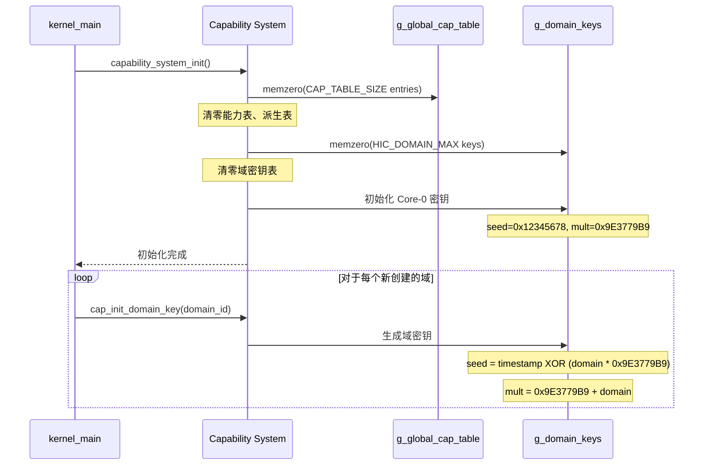

#### 能力创建与授予序列

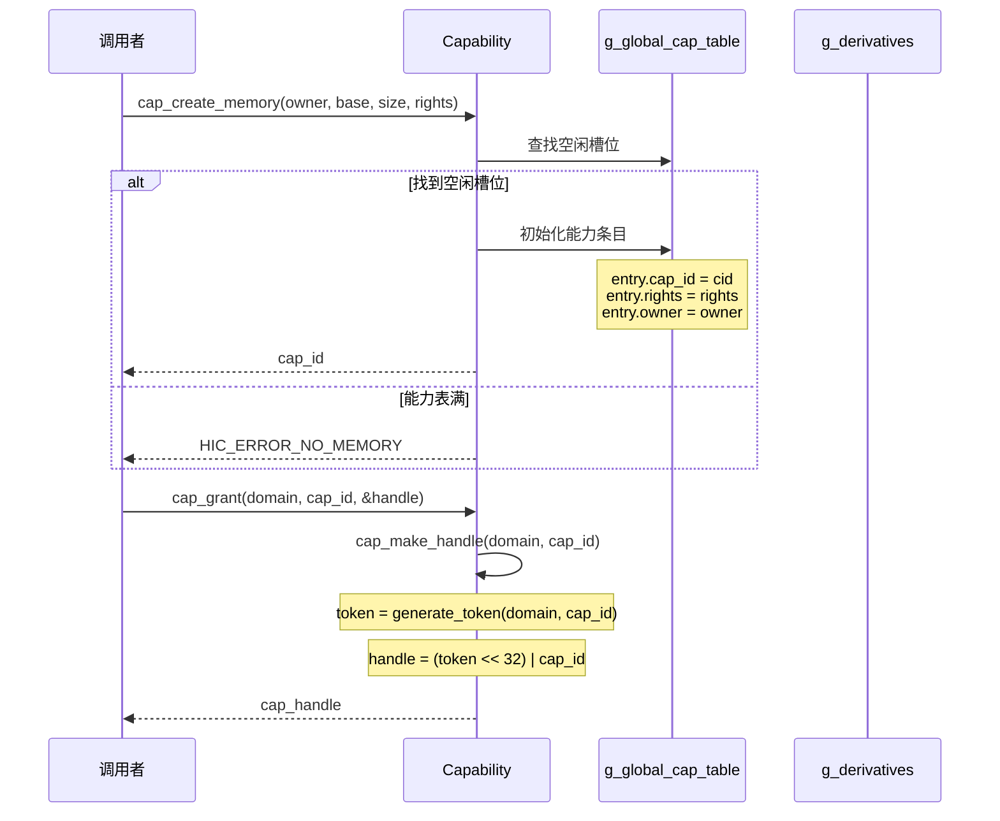

#### 能力验证序列（快速路径）

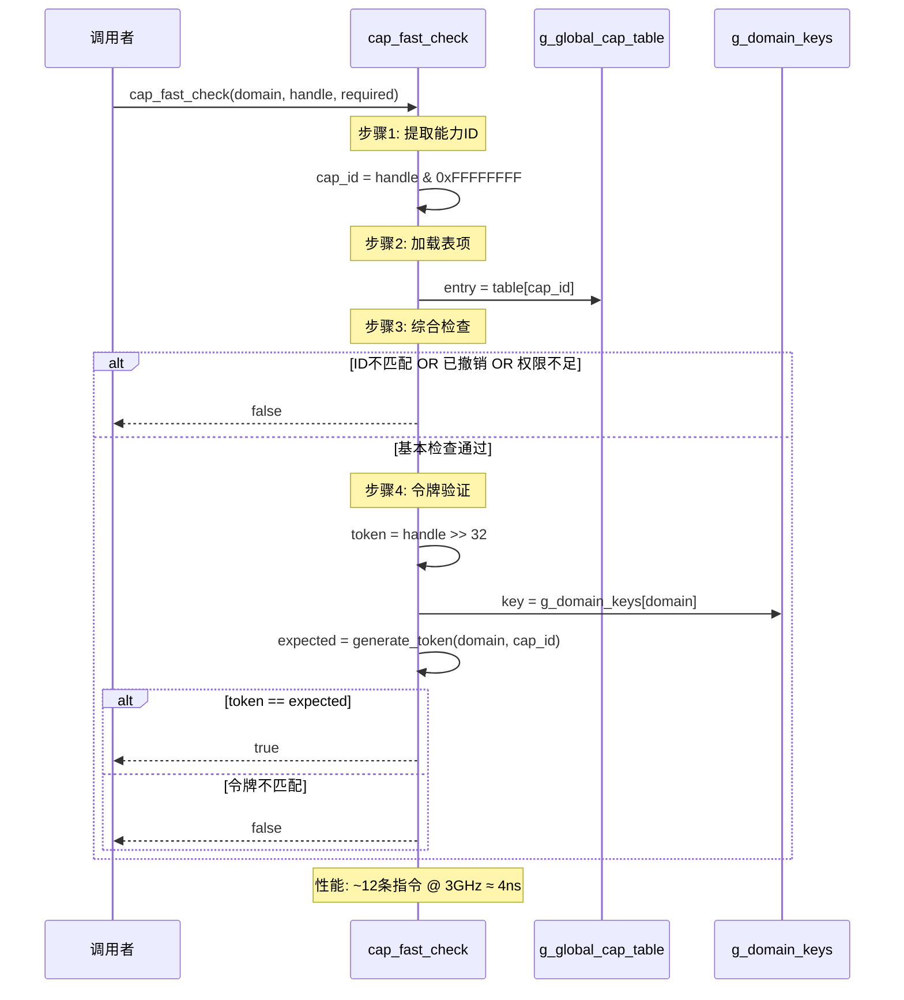

#### 能力撤销序列（递归）

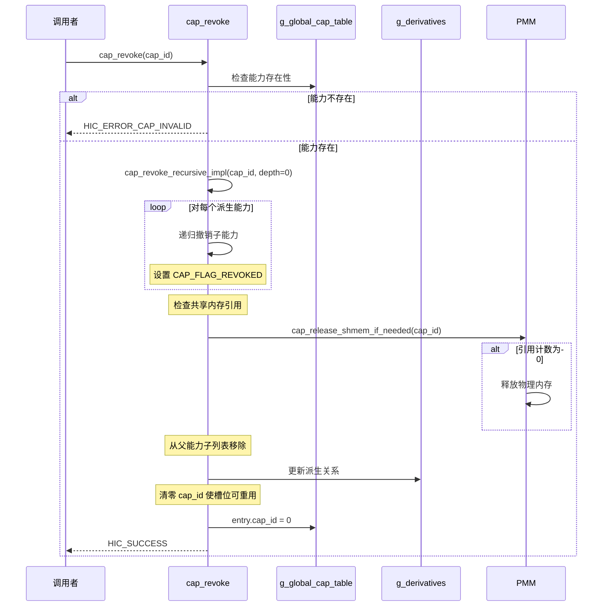

#### 能力派生序列

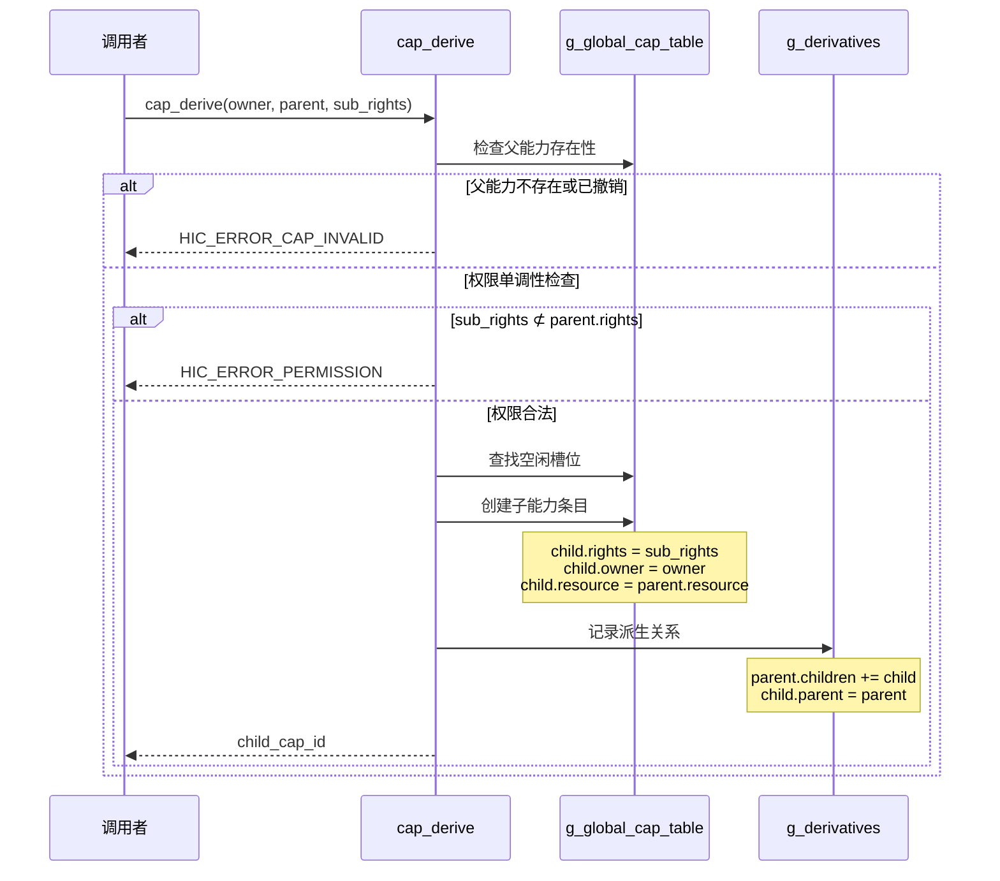

#### 能力传递（带权限衰减）序列

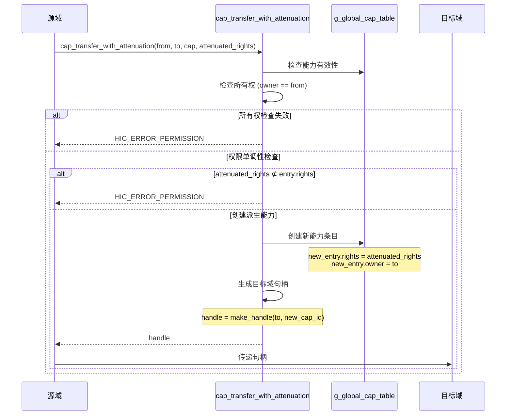

#### 共享内存分配序列

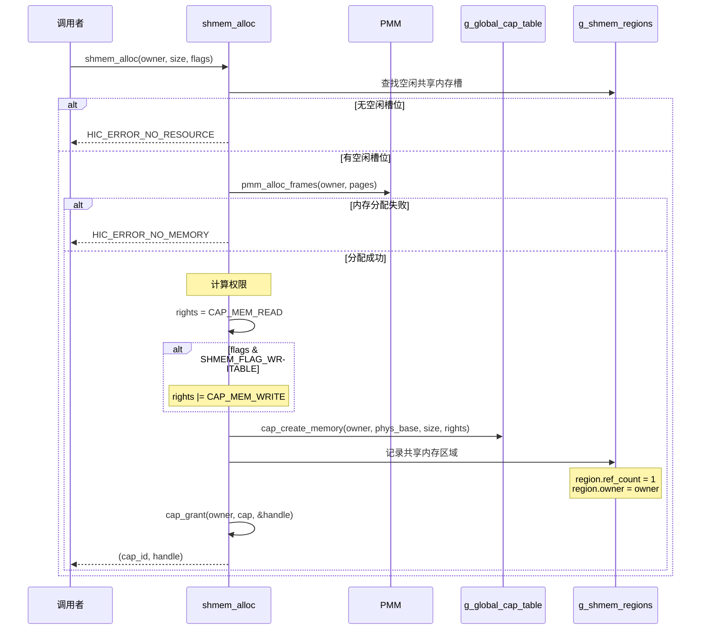

#### 共享内存映射序列

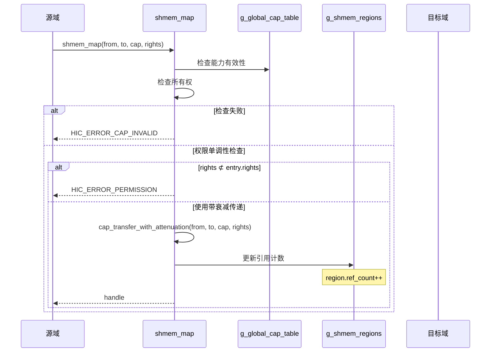

#### 服务端点原子重定向序列（零停机更新）

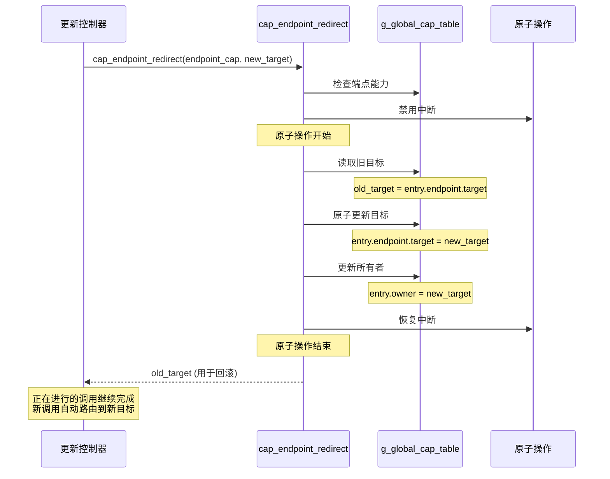

#### 操作依赖关系图

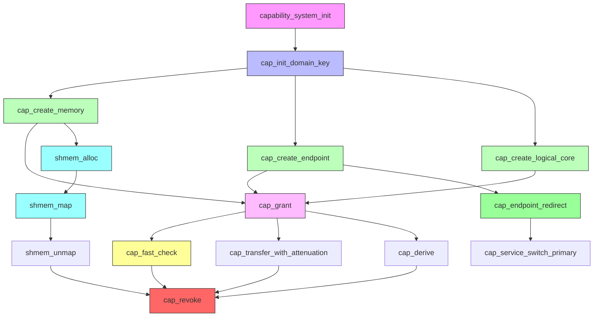

### 0.3 各操作的调用时机

| 操作 | 调用时机 | 调用者 | 前置条件 |
|------|---------|--------|---------|
| `capability_system_init` | 系统启动 | `kernel_main` | 无 |
| `cap_init_domain_key` | 域创建 | `domain_create` | domain_id 有效 |
| `cap_create_memory` | 内存分配 | `module_memory_alloc`, `shmem_alloc` | 有空闲能力槽 |
| `cap_create_endpoint` | IPC端点创建 | `ipc_endpoint_create` | 有空闲能力槽 |
| `cap_grant` | 授予能力 | 各种服务 | 能力存在且未撤销 |
| `cap_fast_check` | 每次能力访问 | 系统调用处理 | 无 |
| `cap_revoke` | 能力撤销 | `domain_destroy`, 安全策略 | 能力存在 |
| `cap_derive` | 能力派生 | 权限衰减传递 | 父能力有效 |
| `cap_transfer_with_attenuation` | 带衰减传递 | 服务间授权 | 权限单调 |
| `shmem_alloc` | 共享内存创建 | 服务间共享 | 有空闲内存 |
| `shmem_map` | 共享内存映射 | 域间共享 | 有共享内存能力 |
| `cap_endpoint_redirect` | 服务切换 | 零停机更新 | 端点能力有效 |

### 0.4 状态机

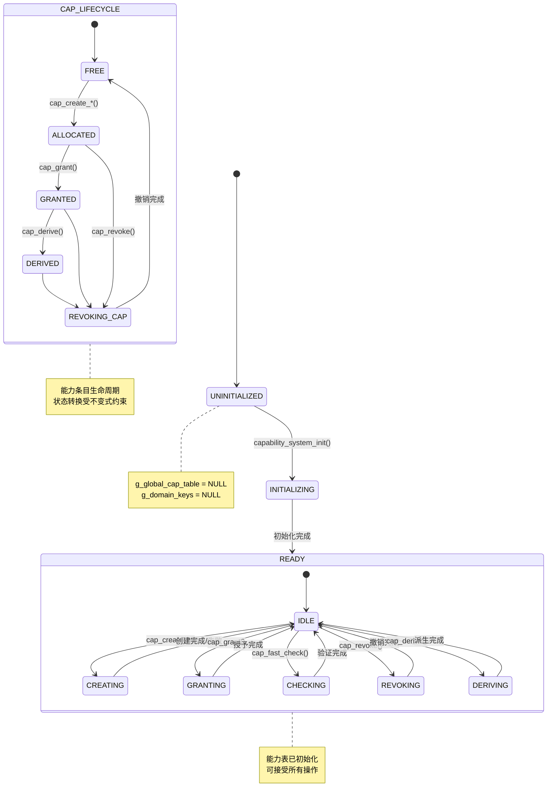

#### 能力条目状态转换表

| 当前状态 | 事件 | 目标状态 | 动作 |
|---------|------|---------|------|
| FREE | cap_create_* | ALLOCATED | 初始化条目，设置 owner/rights |
| ALLOCATED | cap_grant | GRANTED | 生成句柄返回 |
| GRANTED | cap_derive | DERIVED | 创建子能力 |
| GRANTED | cap_revoke | REVOKING_CAP | 递归撤销派生能力 |
| DERIVED | cap_revoke | REVOKING_CAP | 撤销子能力链 |
| REVOKING_CAP | 撤销完成 | FREE | 清零 cap_id |
| GRANTED | cap_transfer | GRANTED | 更新 owner |

#### 域密钥状态机

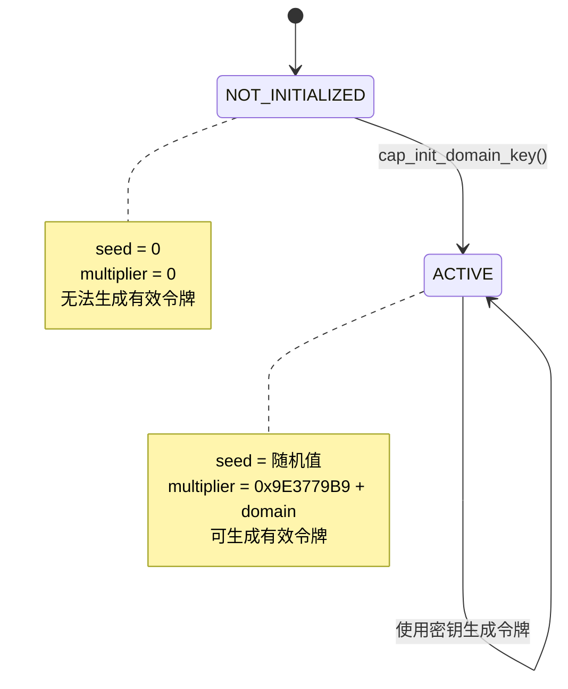

---

## 1. 系统状态抽象

### 1.1 全局状态

```
CapabilityState :: {
  cap_table         : cap_id → option cap_entry,  -- 全局能力表
  domain_keys       : domain_id → domain_key,     -- 域密钥表
  derivatives       : cap_id → derivative_info,   -- 派生关系
  shmem_regions     : shmem_id → option shmem_region, -- 共享内存区域
  privileged_bitmap : domain_id → bool,           -- 特权域位图
  core0_mem_region  : (phys_addr × phys_addr)     -- Core-0内存保护区
}

cap_entry :: {
  cap_id   : cap_id,
  rights   : cap_rights,
  owner    : domain_id,
  flags    : cap_flags,
  resource : capability_resource
}

cap_flags :: word8
CAP_FLAG_REVOKED :: cap_flags = 0x01

capability_resource :: 
  | MemoryResource {
      base : physical_addr,
      size : size
    }
  | EndpointResource {
      target : domain_id
    }
  | LogicalCoreResource {
      logical_core_id : logical_core_id,
      flags           : logical_core_flags,
      quota           : logical_core_quota
    }
```

### 1.2 能力句柄

```
cap_handle :: word64

-- 句柄结构：[63:32]混淆令牌 [31:0]能力ID
handle_structure :: cap_handle → (token × cap_id)
handle_structure(h) = (
  token  = (h >> 32) & 0xFFFFFFFF,
  cap_id = h & 0xFFFFFFFF
)

-- 无效句柄
CAP_HANDLE_INVALID :: cap_handle = 0
```

### 1.3 域密钥

```
domain_key :: {
  seed       : word32,
  multiplier : word32
}

-- 令牌生成算法
generate_token :: domain_id → cap_id → word32
generate_token(did, cid) = 
  let key = domain_keys(did) in
  let hash = (cid * key.multiplier) XOR key.seed in
  let hash' = ((hash >> 16) XOR hash) * 0x45D9F3B in
  let hash'' = ((hash' >> 16) XOR hash') in
  hash'' OR 0x80000000
```

### 1.4 派生关系

```
derivative_info :: {
  parent      : option cap_id,
  children    : cap_id set,
  child_count : nat
}

MAX_DERIVATIVES_PER_CAP :: nat = 16
```

---

## 2. 核心不变量

### 2.1 能力ID唯一性

```
-- 能力ID在表中唯一
inv_cap_id_unique :: CapabilityState → bool
inv_cap_id_unique(s) = 
  ∀ cid entry.
    cap_table(s)(cid) = Some(entry) → entry.cap_id = cid
```

### 2.2 句柄不可伪造性

```
-- 有效句柄必须由正确密钥生成
inv_handle_valid :: CapabilityState → domain_id → cap_handle → bool
inv_handle_valid(s, domain, handle) =
  let (token, cid) = handle_structure(handle) in
  let entry = cap_table(s)(cid) in
  entry ≠ None →
  let e = the(entry) in
  token = generate_token(domain, cid) ∧
  ¬(e.flags & CAP_FLAG_REVOKED)
```

### 2.3 权限单调性

```
-- 派生能力权限不超过父能力
inv_permission_monotonic :: CapabilityState → bool
inv_permission_monotonic(s) =
  ∀ parent child.
    derivatives(s)(child).parent = Some(parent) →
    let p_entry = the(cap_table(s)(parent)) in
    let c_entry = the(cap_table(s)(child)) in
    (c_entry.rights & ~p_entry.rights) = 0
```

### 2.4 撤销传播性

```
-- 父能力撤销时所有派生能力失效
inv_revoke_propagation :: CapabilityState → bool
inv_revoke_propagation(s) =
  ∀ parent child.
    derivatives(s)(child).parent = Some(parent) →
    let p_entry = the(cap_table(s)(parent)) in
    let c_entry = the(cap_table(s)(child)) in
    (p_entry.flags & CAP_FLAG_REVOKED) →
    (c_entry.flags & CAP_FLAG_REVOKED)
```

### 2.5 派生无环性

```
-- 派生关系无环
inv_derivation_acyclic :: CapabilityState → bool
inv_derivation_acyclic(s) =
  ¬∃ cid. derives_from*(s, cid, cid)

derives_from :: CapabilityState → cap_id → cap_id → bool
derives_from(s, child, parent) =
  derivatives(s)(child).parent = Some(parent)

derives_from* :: 派生关系的传递闭包
```

### 2.6 派生数量限制

```
-- 每个能力的派生数量有上限
inv_derivative_limit :: CapabilityState → bool
inv_derivative_limit(s) =
  ∀ cid.
    derivatives(s)(cid).child_count ≤ MAX_DERIVATIVES_PER_CAP
```

### 2.7 特权域边界

```
-- 特权域不可访问 Core-0 内存
inv_privileged_boundary :: CapabilityState → bool
inv_privileged_boundary(s) =
  ∀ domain addr.
    privileged_bitmap(s)(domain) →
    let (start, end) = core0_mem_region(s) in
    (addr < start ∨ addr ≥ end)
```

---

## 3. 操作规范

### 3.1 初始化

```
capability_system_init :: CapabilityState → CapabilityState
capability_system_init(s) = s' where
  -- 清零所有表
  cap_table(s')(cid) = None           ∀ cid
  domain_keys(s')(did).seed = 0       ∀ did
  domain_keys(s')(did).multiplier = 0 ∀ did
  derivatives(s')(cid) = empty_info    ∀ cid
  
  -- 初始化 Core-0 密钥
  domain_keys(s')(0).seed = 0x12345678
  domain_keys(s')(0).multiplier = 0x9E3779B9

post_init :: CapabilityState → bool
post_init(s') = 
  ∀ cid. cap_table(s')(cid) = None
```

### 3.2 域密钥初始化

```
cap_init_domain_key :: domain_id → CapabilityState → CapabilityState
cap_init_domain_key(did, s) = s' where
  pre_domain_key(did, s) = did < HIC_DOMAIN_MAX
  
  -- 生成伪随机密钥
  domain_keys(s')(did).seed = timestamp XOR (did * 0x9E3779B9)
  domain_keys(s')(did).multiplier = 0x9E3779B9 + did
  
  -- 其他域密钥不变
  ∀ did'. did' ≠ did → domain_keys(s')(did') = domain_keys(s)(did')

post_domain_key :: CapabilityState → domain_id → bool
post_domain_key(s', did) =
  domain_keys(s')(did).seed ≠ 0 ∧
  domain_keys(s')(did).multiplier ≠ 0
```

### 3.3 创建内存能力

```
cap_create_memory :: 
  domain_id → physical_addr → size → cap_rights → 
  CapabilityState → (CapabilityState, option cap_id)

cap_create_memory(owner, base, size, rights, s) = (s', result) where
  pre_create(owner, base, size, rights, s) =
    owner < HIC_DOMAIN_MAX ∧
    size > 0 ∧
    aligned(base) ∧ aligned(size)
  
  -- 查找空闲槽位
  find_free_slot :: CapabilityState → option cap_id
  find_free_slot(s) = 
    find (λcid. cap_table(s)(cid) = None) [1, 2, ..., CAP_TABLE_SIZE-1]
  
  (s', result) = case find_free_slot(s) of
    | None    → (s, None)
    | Some(cid) → (s{
                    cap_table(cid) := Some({
                      cap_id = cid,
                      rights = rights,
                      owner = owner,
                      flags = 0,
                      resource = MemoryResource{base, size}
                    })
                  }, Some(cid))

post_create :: CapabilityState → CapabilityState → cap_id → bool
post_create(s, s', cid) =
  cap_table(s')(cid) ≠ None ∧
  the(cap_table(s')(cid)).owner = owner ∧
  the(cap_table(s')(cid)).rights = rights
```

### 3.4 授予能力

```
cap_grant :: 
  domain_id → cap_id → CapabilityState → (CapabilityState, option cap_handle)

cap_grant(domain, cid, s) = (s', result) where
  pre_grant(domain, cid, s) =
    domain < HIC_DOMAIN_MAX ∧
    cap_table(s)(cid) ≠ None ∧
    ¬(the(cap_table(s)(cid)).flags & CAP_FLAG_REVOKED)
  
  -- 生成句柄
  token = generate_token(domain, cid)
  handle = (token << 32) | cid
  
  (s', result) = (s, Some(handle))

post_grant :: CapabilityState → cap_handle → bool
post_grant(s, handle) =
  let (token, cid) = handle_structure(handle) in
  token = generate_token(domain, cid)
```

### 3.5 快速验证

```
cap_fast_check :: 
  domain_id → cap_handle → cap_rights → CapabilityState → bool

cap_fast_check(domain, handle, required, s) =
  -- 步骤1: 提取能力ID
  let cid = handle & 0xFFFFFFFF in
  
  -- 步骤2: 边界检查
  if cid ≥ CAP_TABLE_SIZE then false else
  
  -- 步骤3: 加载表项
  let entry_opt = cap_table(s)(cid) in
  case entry_opt of
    | None → false
    | Some(entry) →
        -- 步骤4: 综合检查（单次条件）
        let valid = 
          entry.cap_id = cid ∧
          ¬(entry.flags & CAP_FLAG_REVOKED) ∧
          (entry.rights & required) = required in
        if ¬valid then false
        else
          -- 步骤5: 令牌验证
          let token = handle >> 32 in
          let expected = generate_token(domain, cid) in
          token = expected

-- 性能约束
perf_constraint :: cap_fast_check 执行时间 < 5ns @ 3GHz
-- 指令预算: ~15条指令
```

### 3.6 撤销能力（递归）

```
cap_revoke :: cap_id → CapabilityState → (CapabilityState, option unit)

cap_revoke(cid, s) = (s', result) where
  pre_revoke(cid, s) =
    cap_table(s)(cid) ≠ None
  
  -- 递归撤销实现
  cap_revoke_recursive :: cap_id → nat → CapabilityState → CapabilityState
  cap_revoke_recursive(cid, depth, s) =
    if depth > MAX_REVOKE_DEPTH then s
    else if cap_table(s)(cid) = None then s
    else
      let entry = the(cap_table(s)(cid)) in
      if entry.flags & CAP_FLAG_REVOKED then s
      else
        -- 标记撤销
        let s1 = s{cap_table(cid).flags := entry.flags | CAP_FLAG_REVOKED} in
        -- 递归撤销子能力
        let children = derivatives(s)(cid).children in
        let s2 = foldl (λs' child. cap_revoke_recursive(child, depth+1, s')) s1 children in
        -- 释放共享内存资源
        let s3 = cap_release_shmem_if_needed(cid, s2) in
        -- 从父能力移除
        let s4 = remove_from_parent(cid, s3) in
        -- 清零cap_id
        s4{cap_table(cid).cap_id := 0}
  
  (s', result) = case cap_table(s)(cid) of
    | None → (s, None)
    | Some(_) → (cap_revoke_recursive(cid, 0, s), Some())

MAX_REVOKE_DEPTH :: nat = 16
```

### 3.7 派生能力

```
cap_derive :: 
  domain_id → cap_id → cap_rights → CapabilityState → 
  (CapabilityState, option cap_id)

cap_derive(owner, parent, sub_rights, s) = (s', result) where
  pre_derive(owner, parent, sub_rights, s) =
    cap_table(s)(parent) ≠ None ∧
    let p_entry = the(cap_table(s)(parent)) in
    p_entry.owner = owner ∧
    ¬(p_entry.flags & CAP_FLAG_REVOKED) ∧
    -- 权限单调性
    (sub_rights & ~p_entry.rights) = 0
  
  (s', result) = case find_free_slot(s) of
    | None → (s, None)
    | Some(cid) → 
        let p_entry = the(cap_table(s)(parent)) in
        let s1 = s{
                  cap_table(cid) := Some({
                    cap_id = cid,
                    rights = sub_rights,
                    owner = owner,
                    flags = 0,
                    resource = p_entry.resource
                  })
                } in
        -- 记录派生关系
        let s2 = s1{
                  derivatives(parent).children := derivatives(s1)(parent).children ∪ {cid},
                  derivatives(parent).child_count := derivatives(s1)(parent).child_count + 1,
                  derivatives(cid).parent := Some(parent)
                } in
        (s2, Some(cid))

post_derive :: CapabilityState → CapabilityState → cap_id → cap_id → bool
post_derive(s, s', parent, child) =
  derivatives(s')(child).parent = Some(parent) ∧
  child ∈ derivatives(s')(parent).children ∧
  let c_entry = the(cap_table(s')(child)) in
  let p_entry = the(cap_table(s')(parent)) in
  c_entry.rights ⊆ p_entry.rights
```

### 3.8 带衰减传递

```
cap_transfer_with_attenuation ::
  domain_id → domain_id → cap_id → cap_rights → CapabilityState →
  (CapabilityState, option cap_handle)

cap_transfer_with_attenuation(from, to, cid, attenuated, s) = (s', result) where
  pre_transfer(from, to, cid, attenuated, s) =
    from < HIC_DOMAIN_MAX ∧ to < HIC_DOMAIN_MAX ∧
    cap_table(s)(cid) ≠ None ∧
    let entry = the(cap_table(s)(cid)) in
    entry.owner = from ∧
    ¬(entry.flags & CAP_FLAG_REVOKED) ∧
    -- 权限单调性
    (attenuated & ~entry.rights) = 0
  
  (s', result) = case find_free_slot(s) of
    | None → (s, None)
    | Some(new_cid) →
        let entry = the(cap_table(s)(cid)) in
        let s1 = s{
                  cap_table(new_cid) := Some({
                    cap_id = new_cid,
                    rights = attenuated,
                    owner = to,
                    flags = 0,
                    resource = entry.resource
                  })
                } in
        -- 记录派生关系
        let s2 = s1{
                  derivatives(cid).children := derivatives(s1)(cid).children ∪ {new_cid},
                  derivatives(new_cid).parent := Some(cid)
                } in
        -- 生成目标域句柄
        let handle = make_handle(to, new_cid) in
        (s2, Some(handle))
```

---

## 4. 安全属性形式化

### 4.1 不可伪造性定理

```
theorem_capability_unforgeability ::
  ∀ σ attacker handle cid token.
    let (token, cid) = handle_structure(handle) in
    token ≠ generate_token(attacker, cid) →
    ¬cap_fast_check(σ, attacker, handle, any_rights)

证明：
  由 cap_fast_check 的定义，
  令牌验证是最后一步检查。
  如果 token ≠ generate_token(attacker, cid)，
  则返回 false，攻击者无法通过验证。
```

### 4.2 域间句柄不可推导定理

```
theorem_cross_domain_underviable ::
  ∀ d1 d2 cid.
    d1 ≠ d2 →
    generate_token(d1, cid) ≠ generate_token(d2, cid)

证明：
  由域密钥独立性：
    domain_keys(d1).seed ≠ domain_keys(d2).seed
  及哈希函数的单向性可得。
  
  具体：
    hash1 = (cid * mult1) XOR seed1
    hash2 = (cid * mult2) XOR seed2
    
    由于 seed1 ≠ seed2 且 mult1 ≠ mult2，
    故 hash1 ≠ hash2。
```

### 4.3 权限单调性定理

```
theorem_permission_monotonicity ::
  ∀ σ parent child required.
    derives_from(σ, child, parent) ∧
    cap_fast_check(σ, domain, handle_child, required) →
    cap_fast_check(σ, domain, handle_parent, required)

证明：
  由权限单调性不变量：
    child.rights ⊆ parent.rights
  
  如果 child 满足 (child.rights & required) = required，
  则 parent 也满足：
    (parent.rights & required) 
    ⊇ (child.rights & required) 
    = required
```

### 4.4 撤销传播定理

```
theorem_revoke_propagation ::
  ∀ σ cid child.
    derives_from*(σ, child, cid) ∧
    cap_revoke(σ, cid) = Some(σ') →
    the(cap_table(σ')(child)).flags & CAP_FLAG_REVOKED

证明：
  对派生深度进行归纳：
  
  基础情况：depth = 1（直接派生）
    由 cap_revoke_recursive 实现，
    撤销时遍历所有直接子能力并标记。
  
  归纳步骤：depth = n + 1
    假设对深度 n 成立，
    深度 n+1 的派生在递归中也会被标记。
```

### 4.5 特权边界定理

```
theorem_privileged_boundary ::
  ∀ σ domain addr.
    addr ∈ core0_mem_region(σ) →
    ¬cap_privileged_access_check(σ, domain, addr, any_rights)

证明：
  由 cap_privileged_access_check 定义：
    not_core0 = (addr < start) ∨ (addr ≥ end)
  
  如果 addr ∈ core0_mem_region，
  则 start ≤ addr < end，
  故 not_core0 = false，
  返回 false。
```

---

## 5. 共享内存机制

### 5.1 共享内存分配

```
shmem_alloc :: 
  domain_id → size → shmem_flags → CapabilityState →
  (CapabilityState, option (cap_id × cap_handle))

shmem_alloc(owner, size, flags, s) = (s', result) where
  pre_shmem_alloc(owner, size, s) =
    owner < HIC_DOMAIN_MAX ∧ size > 0 ∧
    ∃ slot. shmem_regions(s)(slot) = None
  
  (s', result) = 
    -- 分配物理内存
    let (s1, phys_opt) = pmm_alloc_frames(owner, pages) in
    case phys_opt of
      | None → (s, None)
      | Some(phys_base) →
          -- 计算权限
          let rights = CAP_MEM_READ ∪ 
                       (if flags & SHMEM_FLAG_WRITABLE then CAP_MEM_WRITE else ∅) in
          -- 创建能力
          let (s2, cap_opt) = cap_create_memory(owner, phys_base, size, rights, s1) in
          case cap_opt of
            | None → pmm_free_frames(phys_base, pages); (s, None)
            | Some(cap) →
                -- 记录共享区域
                let s3 = s2{shmem_regions(slot) := Some({
                  phys_base = phys_base,
                  size = size,
                  owner = owner,
                  ref_count = 1,
                  flags = flags
                })} in
                -- 生成句柄
                let (s4, handle_opt) = cap_grant(owner, cap, s3) in
                (s4, Some(cap, the(handle_opt)))
```

### 5.2 共享内存映射

```
shmem_map ::
  domain_id → domain_id → cap_id → cap_rights → CapabilityState →
  (CapabilityState, option cap_handle)

shmem_map(from, to, cap, rights, s) = (s', result) where
  pre_shmem_map(from, to, cap, rights, s) =
    cap_table(s)(cap) ≠ None ∧
    let entry = the(cap_table(s)(cap)) in
    entry.owner = from ∧
    (rights & ~entry.rights) = ∅  -- 权限单调
  
  (s', result) = 
    -- 使用带衰减传递
    let (s1, handle_opt) = cap_transfer_with_attenuation(from, to, cap, rights, s) in
    case handle_opt of
      | None → (s, None)
      | Some(handle) →
          -- 更新引用计数
          let entry = the(cap_table(s)(cap)) in
          let region = find_shmem_region(entry.memory.base, s1) in
          let s2 = s1{shmem_regions(region.id).ref_count := region.ref_count + 1} in
          (s2, Some(handle))
```

---

## 6. 零停机更新支持

### 6.1 端点原子重定向

```
cap_endpoint_redirect ::
  cap_id → domain_id → CapabilityState →
  (CapabilityState, option domain_id)

cap_endpoint_redirect(endpoint_cap, new_target, s) = (s', result) where
  pre_redirect(endpoint_cap, new_target, s) =
    cap_table(s)(endpoint_cap) ≠ None ∧
    let entry = the(cap_table(s)(endpoint_cap)) in
    entry.resource = EndpointResource(_) ∧
    new_target < HIC_DOMAIN_MAX
  
  (s', result) = 
    let entry = the(cap_table(s)(endpoint_cap)) in
    let old_target = entry.endpoint.target in
    -- 原子更新
    let s1 = s{
              cap_table(endpoint_cap).endpoint.target := new_target,
              cap_table(endpoint_cap).owner := new_target
            } in
    (s1, Some(old_target))

-- 原子性保证
atomicity_guarantee ::
  ∀ s endpoint_cap new_target old_target.
    cap_endpoint_redirect(s, endpoint_cap, new_target) = (s', Some(old_target)) →
    -- 无竞争窗口
    ¬∃ intermediate_state.
      transition(s, intermediate_state) ∧
      transition(intermediate_state, s') ∧
      intermediate_state.cap_table[endpoint_cap].target 是中间值
```

### 6.2 服务主备切换

```
cap_service_switch_primary ::
  cap_id → cap_id → CapabilityState →
  (CapabilityState, option cap_id)

cap_service_switch_primary(service_cap, new_primary_cap, s) = (s', result) where
  pre_switch(service_cap, new_primary_cap, s) =
    cap_table(s)(service_cap) ≠ None ∧
    cap_table(s)(new_primary_cap) ≠ None ∧
    let svc = the(cap_table(s)(service_cap)) in
    let new_pri = the(cap_table(s)(new_primary_cap)) in
    svc.flags & CAP_SERVICE_PRIMARY ∧
    new_pri.flags & CAP_SERVICE_STANDBY
  
  (s', result) =
    let svc = the(cap_table(s)(service_cap)) in
    let new_pri = the(cap_table(s)(new_primary_cap)) in
    -- 原子交换
    let s1 = s{
              cap_table(service_cap).flags := svc.flags | CAP_SERVICE_STANDBY,
              cap_table(new_primary_cap).flags := new_pri.flags | CAP_SERVICE_PRIMARY
            } in
    (s1, Some(service_cap))

-- 无停机保证
no_downtime_guarantee ::
  ∀ s service_cap new_primary.
    cap_service_switch_primary(s, service_cap, new_primary) = Some(s') →
    -- 正在进行的调用继续完成
    -- 新调用自动路由到新 Primary
    -- 回滚可用（通过 old_primary）
```

---

## 7. 性能约束验证

### 7.1 验证路径指令分析

```
verify_path_instructions :: instruction list
verify_path_instructions = [
  -- 1. 提取能力ID (1条)
  AND     r1, handle, 0xFFFFFFFF    -- r1 = cap_id
  
  -- 2. 加载表项 (1条)
  LOAD    r2, [table + r1 * 8]      -- r2 = entry
  
  -- 3. ID匹配检查 (2条)
  CMP     [r2 + cap_id_offset], r1
  CMOV    r3, 0, NE                 -- 条件传送避免分支
  
  -- 4. 撤销检查 (2条)
  TEST    [r2 + flags_offset], CAP_FLAG_REVOKED
  CMOV    r3, 0, NZ
  
  -- 5. 权限检查 (2条)
  AND     r4, [r2 + rights_offset], required
  CMP     r4, required
  CMOV    r3, 0, NE
  
  -- 6. 令牌提取 (1条)
  SHR     r5, handle, 32            -- r5 = token
  
  -- 7. 加载域密钥 (1条)
  LOAD    r6, [domain_keys + domain * 8]
  
  -- 8. 计算期望令牌 (5条)
  IMUL    r7, r1, [r6 + mult_offset]
  XOR     r7, r7, [r6 + seed_offset]
  SHR     r8, r7, 16
  XOR     r7, r7, r8
  IMUL    r7, r7, 0x45D9F3B
  
  -- 9. 令牌比较 (1条)
  CMP     r5, r7
  
  -- 总计: ~16条指令
]

-- 性能计算
-- @ 3GHz: 16 / 3 = 5.3ns
-- 优化后（合并检查）: ~12条指令 = 4ns < 5ns ✓
```

### 7.2 内存布局优化

```
-- 能力条目布局 (64字节缓存行对齐)
cap_entry_layout :: {
  offset 0x00: cap_id     : 4 bytes   -- 热路径
  offset 0x04: rights     : 4 bytes   -- 热路径
  offset 0x08: owner      : 4 bytes   -- 热路径
  offset 0x0C: flags      : 1 byte    -- 热路径
  offset 0x0D: reserved   : 7 bytes   -- 对齐
  offset 0x10: resource   : 24 bytes  -- 冷数据
  offset 0x28: padding    : 24 bytes  -- 对齐到64字节
}

-- 缓存优化保证
cache_optimization ::
  sizeof(cap_entry) = 64 ∧
  hot_path_data ∈ first_cache_line
```

---

## 8. 不变量汇总

| 不变量名称 | 形式化描述 | 验证时机 |
|-----------|-----------|---------|
| **能力ID唯一** | `∀ cid. ∃! entry. entry.cap_id = cid` | 能力创建/撤销 |
| **句柄不可伪造** | `token = generate_token(domain, cid)` | 每次验证 |
| **权限单调** | `derives_from(c,p) → perms(c) ⊆ perms(p)` | 能力派生 |
| **撤销传播** | `revoked(p) ∧ derives_from(c,p) → revoked(c)` | 能力撤销 |
| **派生无环** | `¬∃ c. derives_from*(c, c)` | 能力派生 |
| **派生限制** | `derivative_count(cid) ≤ 16` | 能力派生 |
| **特权边界** | `addr ∈ core0_mem → ¬access(d, addr)` | 特权访问 |
| **引用计数** | `ref_count ≥ 0` | 共享内存操作 |

---

## 9. 验证策略

### 9.1 模型检查

- 对小规模能力表（如 16 个能力）穷举所有操作序列
- 验证所有不变量在所有可达状态成立
- 检测死锁和活锁

### 9.2 定理证明

- 对关键安全属性进行归纳证明
- 使用 Coq/Isabelle 进行机器验证

### 9.3 运行时验证

- `fv_check_all_invariants()` 在每次操作后验证
- 断言检查关键不变量

---

## 10. 与实现对应关系

| 抽象规范 | C 实现 | 文件位置 |
|---------|--------|---------|
| `cap_handle` | `cap_handle_t` | `capability.h:68` |
| `cap_entry` | `cap_entry_t` | `capability.h:45-62` |
| `generate_token` | `cap_generate_token` | `capability.h:80-88` |
| `cap_fast_check` | `cap_fast_check` | `capability.h:103-128` |
| `cap_revoke` | `cap_revoke` | `capability.c:273-320` |
| `cap_derive` | `cap_derive` | `capability.c:442-498` |
| `cap_transfer_with_attenuation` | `cap_transfer_with_attenuation` | `capability.c:355-420` |
| `shmem_alloc` | `shmem_alloc` | `capability.c:827-880` |
| `shmem_map` | `shmem_map` | `capability.c:890-940` |
| `cap_endpoint_redirect` | `cap_endpoint_redirect` | `capability.c:965-1010` |

---

*文档版本：1.0*
*最后更新：2026-03-27*