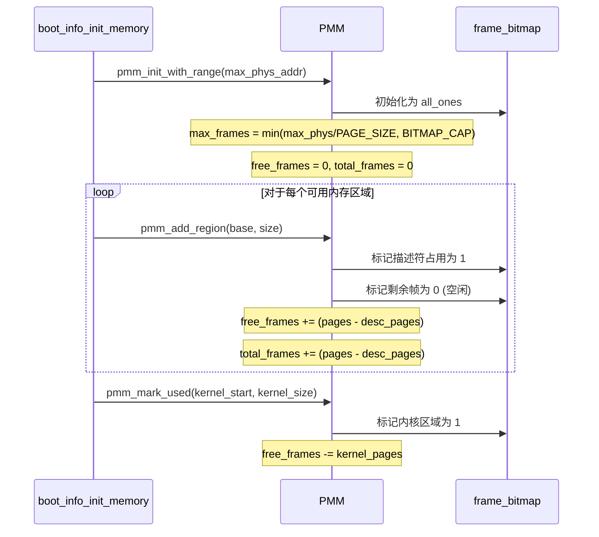
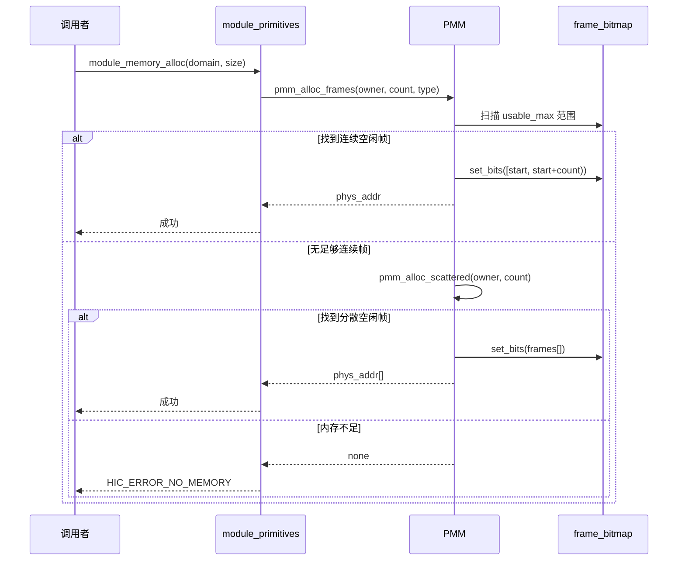
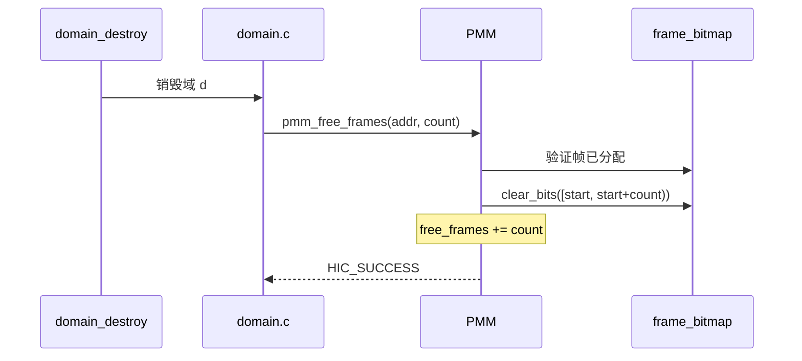
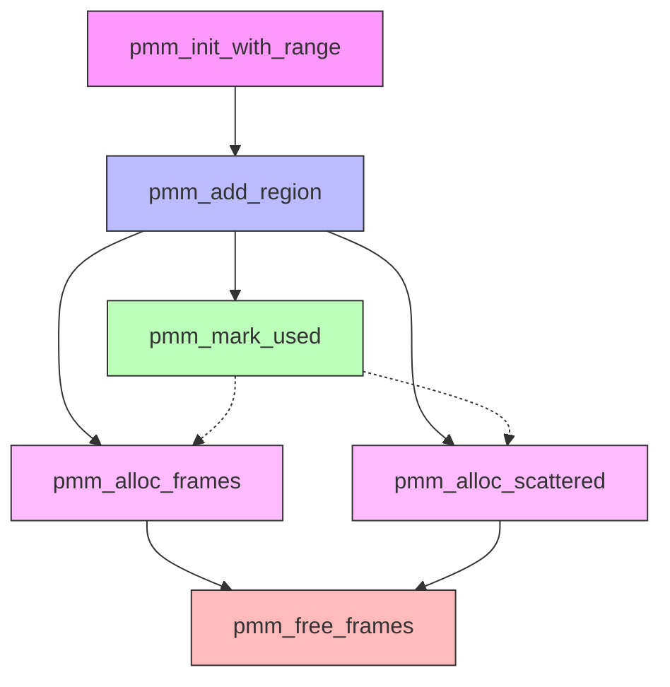
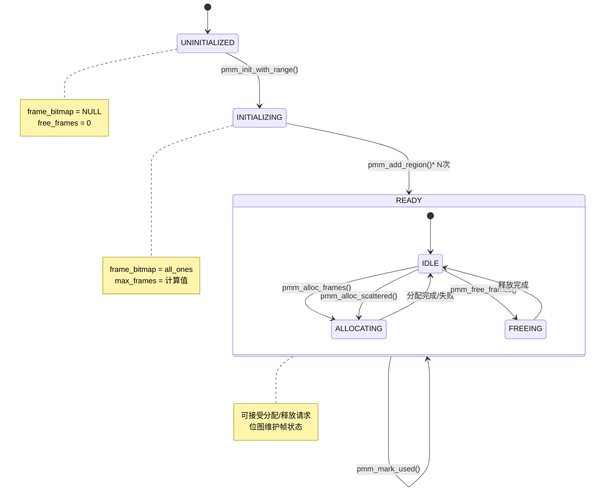

# PMM 物理内存管理器抽象规范

> 本文档用高阶逻辑描述 HIC 物理内存管理器"做什么"，定义状态、操作和安全属性。

---

## 0. 初始化与操作顺序

### 0.1 系统启动时的 PMM 初始化流程

```
启动流程：
1. boot_info_init_memory()
   ├─ pmm_init_with_range(max_phys_addr)     -- 初始化位图，所有帧标记为已使用
   │
   ├─ for each usable memory region:
   │    └─ pmm_add_region(base, size)         -- 添加可用内存，标记为空闲
   │
   └─ pmm_mark_used(kernel_start, kernel_size) -- 标记内核占用为已使用

状态变迁：
  初始:   frame_bitmap = all_ones, free_frames = 0
  添加区域: frame_bitmap[region] = 0, free_frames += region_pages
  标记内核: frame_bitmap[kernel] = 1, free_frames -= kernel_pages
```

### 0.2 操作依赖顺序

#### 初始化序列图



#### 运行时分配序列



#### 域销毁释放序列



#### 操作依赖关系图



### 0.3 各操作的调用时机

| 操作 | 调用时机 | 调用者 | 前置条件 |
|------|---------|--------|---------|
| `pmm_init_with_range` | 系统启动 | `boot_info_init_memory` | 无 |
| `pmm_add_region` | 启动时添加可用内存 | `boot_info_init_memory` | PMM 已初始化 |
| `pmm_mark_used` | 标记内核/保留区 | `boot_info_init_memory` | 区域已添加 |
| `pmm_alloc_frames` | 域创建、栈分配、页表分配 | `module_memory_alloc`, `thread_create` | 有足够空闲帧 |
| `pmm_alloc_scattered` | 大块非连续分配 | `module_memory_alloc` | 有足够空闲帧 |
| `pmm_free_frames` | 域销毁、线程退出 | `domain_destroy`, `thread_exit` | 帧已分配 |

### 0.4 状态机



#### 状态转换表

| 当前状态 | 事件 | 目标状态 | 动作 |
|---------|------|---------|------|
| UNINITIALIZED | pmm_init_with_range | INITIALIZING | 分配位图，初始化计数器 |
| INITIALIZING | pmm_add_region | INITIALIZING | 更新位图，增加 free_frames |
| INITIALIZING | 完成 | READY | 设置 usable_max |
| READY/IDLE | pmm_alloc_frames | READY/ALLOCATING | 查找并标记帧 |
| READY/IDLE | pmm_alloc_scattered | READY/ALLOCATING | 查找分散帧 |
| READY/IDLE | pmm_free_frames | READY/FREEING | 清除位图位 |
| READY/ALLOCATING | 完成 | READY/IDLE | 更新计数器 |
| READY/FREEING | 完成 | READY/IDLE | 更新计数器 |
| READY | pmm_mark_used | READY | 标记帧为已用 |

---

## 1. 系统状态抽象

### 1.1 全局状态

```
PMMState :: {
  frame_bitmap   : bit_array,        -- 页帧位图：0=空闲，1=已分配
  max_frames     : nat,              -- 位图可管理的最大帧数
  usable_max     : nat,              -- 实际可用物理内存最高帧索引
  total_frames   : nat,              -- 累计添加的可用帧数
  free_frames    : nat,              -- 当前空闲帧数
  mem_regions    : mem_region list,  -- 内存区域链表
  used_memory    : nat,              -- 已使用内存（字节）
  total_memory   : nat               -- 总可用内存（字节）
}

mem_region :: {
  base  : physical_addr,
  size  : nat,
  next  : option mem_region  -- 链表指针
}
```

### 1.2 页帧信息

```
page_frame :: {
  base_addr : physical_addr,
  ref_count : nat,           -- 注意：当前实现仅为 0/1
  type      : page_frame_type,
  owner     : domain_id
}

page_frame_type :: 
  | PAGE_FRAME_FREE        -- 空闲
  | PAGE_FRAME_CORE        -- 核心域
  | PAGE_FRAME_PRIVILEGED  -- 特权域
  | PAGE_FRAME_SHARED      -- 共享内存
```

---

## 2. 核心不变量

### 2.1 计数一致性

```
-- 空闲帧计数与位图一致
inv_free_count :: PMMState → bool
inv_free_count(s) = 
  free_frames(s) = |{f | f < max_frames(s) ∧ frame_bitmap(s)[f] = 0}|

-- 总帧数与区域累加一致
inv_total_frames :: PMMState → bool
inv_total_frames(s) =
  total_frames(s) = Σ_{r ∈ mem_regions(s)} (size(r) / PAGE_SIZE)
```

### 2.2 边界约束

```
-- 可用范围不超过可管理范围
inv_bounds :: PMMState → bool
inv_bounds(s) = 
  usable_max(s) ≤ max_frames(s) ∧
  total_frames(s) ≤ max_frames(s) ∧
  free_frames(s) ≤ total_frames(s)
```

### 2.3 内存区域完整性

```
-- 区域描述符不重叠
inv_region_disjoint :: PMMState → bool
inv_region_disjoint(s) =
  ∀ r1 r2 ∈ mem_regions(s). 
    r1 ≠ r2 → 
      [base(r1), base(r1) + size(r1)) ∩ [base(r2), base(r2) + size(r2)) = ∅
```

### 2.4 位图与区域一致

```
-- 区域内的帧必须是空闲的（描述符占用的除外）
inv_region_bitmap :: PMMState → bool
inv_region_bitmap(s) =
  ∀ r ∈ mem_regions(s), f ∈ frames_of(r).
    frame_bitmap(s)[f] = 0 ∨ f ∈ descriptor_pages(r)
```

---

## 3. 操作规范

### 3.1 初始化

```
pmm_init :: phys_addr → PMMState → PMMState
pmm_init(max_phys, s) = s' where
  max_frames(s')   = min(max_phys / PAGE_SIZE, BITMAP_CAPACITY)
  frame_bitmap(s') = all_ones               -- 初始全部标记为已使用
  total_frames(s') = 0
  free_frames(s')  = 0
  usable_max(s')   = 0
  mem_regions(s')  = []
  
-- 后置条件：位图覆盖 [0, max_frames)
post_init :: PMMState → bool
post_init(s') = 
  length(frame_bitmap(s')) ≥ max_frames(s') / 8
```

### 3.2 添加内存区域

```
pmm_add_region :: phys_addr → nat → PMMState → PMMState
pmm_add_region(base, size, s) = s' where
  -- 前置条件
  pre_add_region(s, base, size) =
    size ≥ PAGE_SIZE ∧
    aligned(base) ∧ aligned(size)
  
  -- 计算帧范围
  start_frame   = base / PAGE_SIZE
  num_frames    = size / PAGE_SIZE
  desc_pages    = ceil(sizeof(mem_region) / PAGE_SIZE)
  
  -- 边界检查与截断
  (actual_frames, truncated) = 
    if start_frame ≥ max_frames(s) then (0, true)
    else if start_frame + num_frames > max_frames(s) 
         then (max_frames(s) - start_frame, true)
         else (num_frames, false)
  
  -- 标记描述符占用
  bitmap_after_desc = set_bits(frame_bitmap(s), 
                                [start_frame, start_frame + desc_pages))
  
  -- 标记剩余空闲
  bitmap_final = clear_bits(bitmap_after_desc,
                             [start_frame + desc_pages, 
                              start_frame + actual_frames))
  
  -- 更新状态
  free_frames(s')  = free_frames(s) + (actual_frames - desc_pages)
  total_frames(s') = total_frames(s) + (actual_frames - desc_pages)
  usable_max(s')   = max(usable_max(s), start_frame + actual_frames)
  mem_regions(s')  = mem_regions(s) ++ [new_region]
  
-- 后置条件
post_add_region :: PMMState → PMMState → bool
post_add_region(s, s') =
  free_frames(s') ≥ free_frames(s) ∧
  total_frames(s') ≥ total_frames(s) ∧
  inv_free_count(s') ∧ inv_bounds(s')
```

### 3.3 标记内存已使用

```
pmm_mark_used :: phys_addr → nat → PMMState → PMMState
pmm_mark_used(base, size, s) = s' where
  start = page_align(base)
  end   = page_align(base + size)
  
  -- 对每个帧：若空闲则标记为已使用并减少计数
  s' = foldl (λs addr. 
          let f = addr / PAGE_SIZE in
          if f < max_frames(s) ∧ frame_bitmap(s)[f] = 0 then
            s{frame_bitmap[f] := 1, 
              free_frames := free_frames(s) - 1,
              used_memory := used_memory(s) + PAGE_SIZE}
          else s)
        s [start, start + PAGE_SIZE, ..., end - PAGE_SIZE)

-- 后置条件：只有原本空闲的帧才减少计数
post_mark_used :: PMMState → PMMState → bool
post_mark_used(s, s') =
  free_frames(s') ≤ free_frames(s) ∧
  used_memory(s') = used_memory(s) + (free_frames(s) - free_frames(s')) * PAGE_SIZE
```

### 3.4 分配帧

```
pmm_alloc_frames :: domain_id → nat → page_frame_type → PMMState → (PMMState, option phys_addr)
pmm_alloc_frames(owner, count, type, s) = (s', result) where

  -- 前置条件
  pre_alloc(s, count) = count > 0 ∧ free_frames(s) ≥ count
  
  -- 查找连续空闲帧（扫描范围为实际可用范围）
  find_consecutive :: PMMState → nat → option nat
  find_consecutive(s, count) = 
    find (λstart. 
      ∀ i ∈ [0, count). 
        frame_bitmap(s)[start + i] = 0 ∧ start + i < usable_max(s))
      [0, 1, ..., usable_max(s) - count]
  
  -- 执行分配
  (s', result) = case find_consecutive(s, count) of
    | none    → (s, none)
    | some f  → (s{
                  frame_bitmap := set_bits(frame_bitmap(s), [f, f + count)),
                  free_frames  := free_frames(s) - count,
                  used_memory  := used_memory(s) + count * PAGE_SIZE
                }, some(f * PAGE_SIZE))

-- 后置条件
post_alloc :: PMMState → PMMState → nat → bool
post_alloc(s, s', count) =
  (result ≠ none → free_frames(s') = free_frames(s) - count) ∧
  inv_free_count(s') ∧ inv_bounds(s')
```

### 3.5 分配分散帧

```
pmm_alloc_scattered :: domain_id → nat → page_frame_type → PMMState → (PMMState, option (phys_addr list))
pmm_alloc_scattered(owner, count, type, s) = (s', result) where

  -- 查找空闲帧（不要求连续）
  find_scattered :: PMMState → nat → option (nat list)
  find_scattered(s, count) = 
    let frees = [f | f ∈ [0, usable_max(s)), frame_bitmap(s)[f] = 0] in
    if length(frees) ≥ count then some(take(count, frees)) else none
  
  -- 执行分配
  (s', result) = case find_scattered(s, count) of
    | none     → (s, none)
    | some fs  → (s{
                    frame_bitmap := foldl (λbm f. set_bit(bm, f)) frame_bitmap(s) fs,
                    free_frames  := free_frames(s) - count,
                    used_memory  := used_memory(s) + count * PAGE_SIZE
                 }, some(map (λf. f * PAGE_SIZE) fs))
```

### 3.6 释放帧

```
pmm_free_frames :: phys_addr → nat → PMMState → PMMState
pmm_free_frames(addr, count, s) = s' where

  -- 前置条件
  pre_free(s, addr, count) =
    count > 0 ∧
    let start = addr / PAGE_SIZE in
    start < max_frames(s) ∧
    ∀ i ∈ [0, count). frame_bitmap(s)[start + i] = 1  -- 必须已分配
  
  -- 执行释放
  start = addr / PAGE_SIZE
  s' = s{
    frame_bitmap := clear_bits(frame_bitmap(s), [start, start + count)),
    free_frames  := free_frames(s) + count,
    used_memory  := used_memory(s) - count * PAGE_SIZE
  }

-- 后置条件
post_free :: PMMState → PMMState → nat → bool  
post_free(s, s', count) =
  free_frames(s') = free_frames(s) + count ∧
  inv_free_count(s') ∧ inv_bounds(s')
```

---

## 4. 安全属性

### 4.1 内存隔离

```
-- 不同域分配的内存在物理上不重叠
isolation_property :: PMMState → domain_id → domain_id → bool
isolation_property(s, d1, d2) =
  let mem1 = allocated_to(s, d1) in
  let mem2 = allocated_to(s, d2) in
  d1 ≠ d2 → mem1 ∩ mem2 = ∅
```

### 4.2 配额强制

```
-- 域分配的内存不超过配额
quota_enforcement :: PMMState → domain → bool
quota_enforcement(s, d) =
  |allocated_to(s, d.id)| ≤ d.mem_quota / PAGE_SIZE
```

### 4.3 无越界分配

```
-- 分配不会超出实际物理内存
no_overflow :: PMMState → bool
no_overflow(s) =
  ∀ f. frame_bitmap(s)[f] = 1 → f < usable_max(s)
```

---

## 6. 验证策略

### 6.1 需要验证的属性

- [ ] 计数一致性：所有操作后 `inv_free_count` 成立
- [ ] 边界安全：分配不会越界
- [ ] 配额强制：域内存使用不超过配额
- [ ] 隔离性：不同域的内存不重叠

### 6.2 验证方法

1. **模型检查**：对小规模内存（如 16 帧）穷举所有操作序列
2. **定理证明**：对关键不变量进行归纳证明
3. **运行时检查**：`fv_check_all_invariants()` 在每次操作后验证

---

*文档版本：1.0*  
*最后更新：2026-03-27*